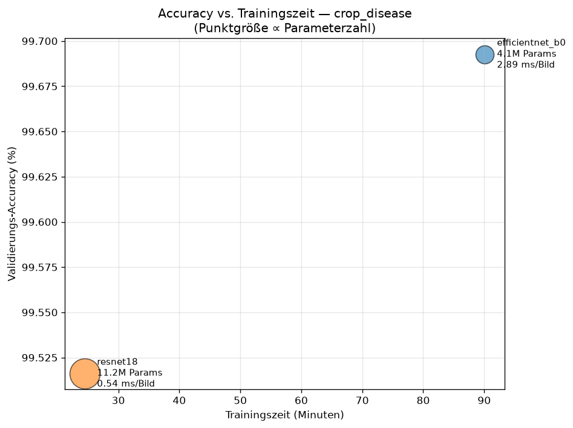
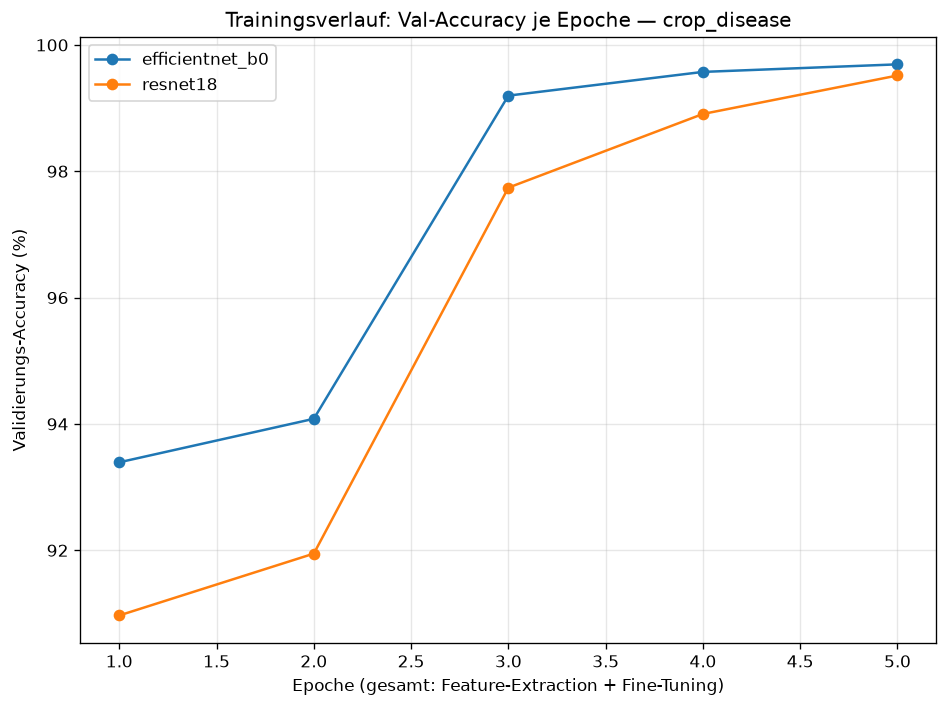
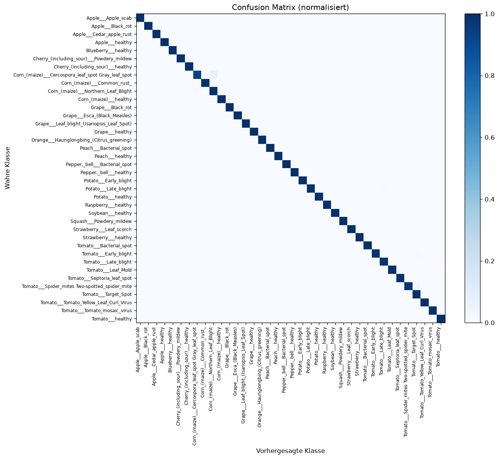
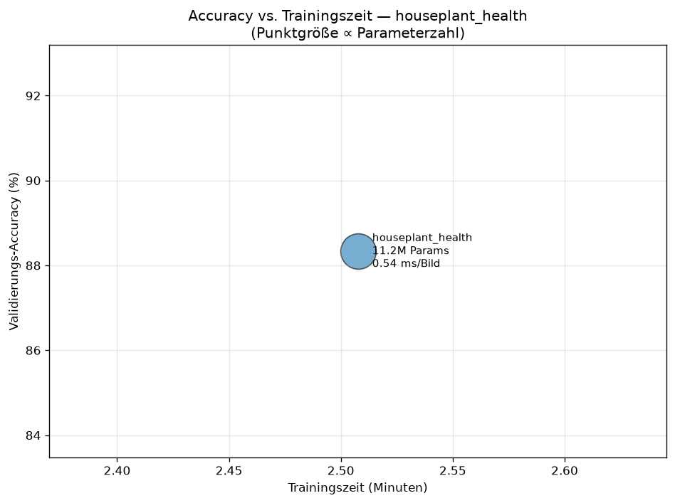
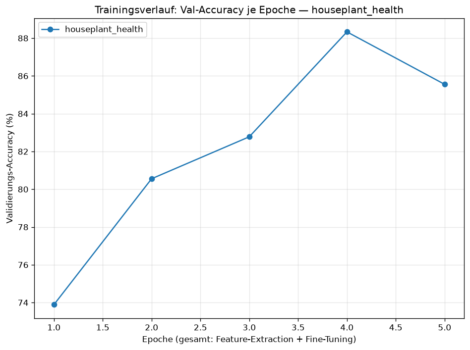
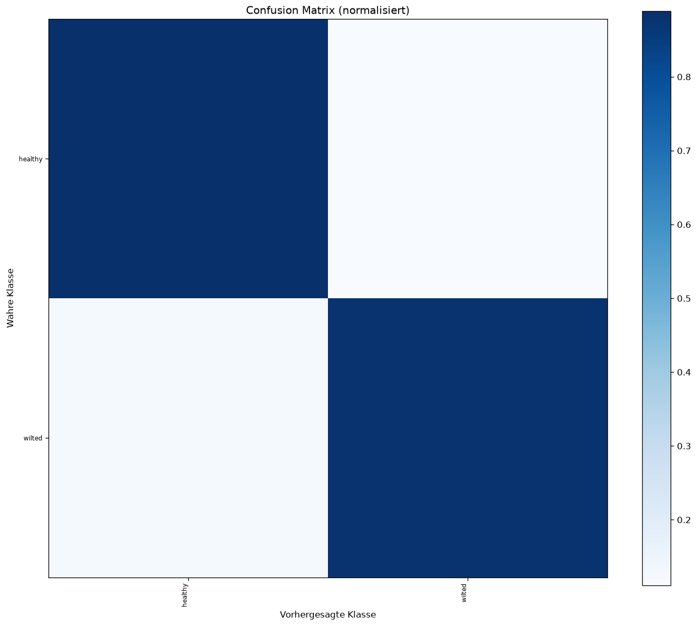
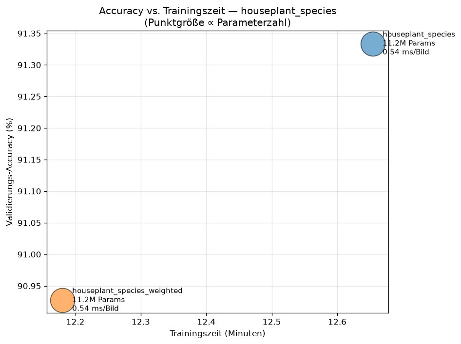
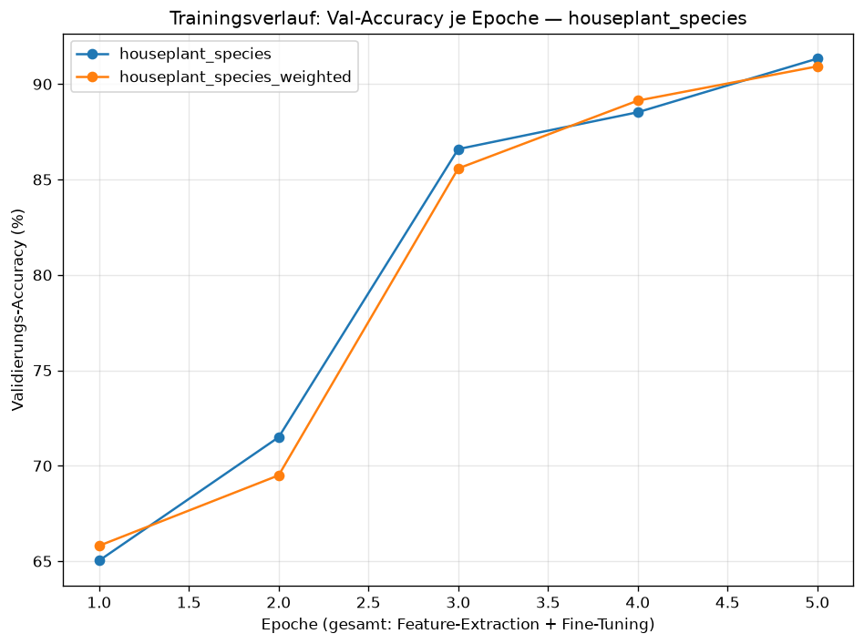
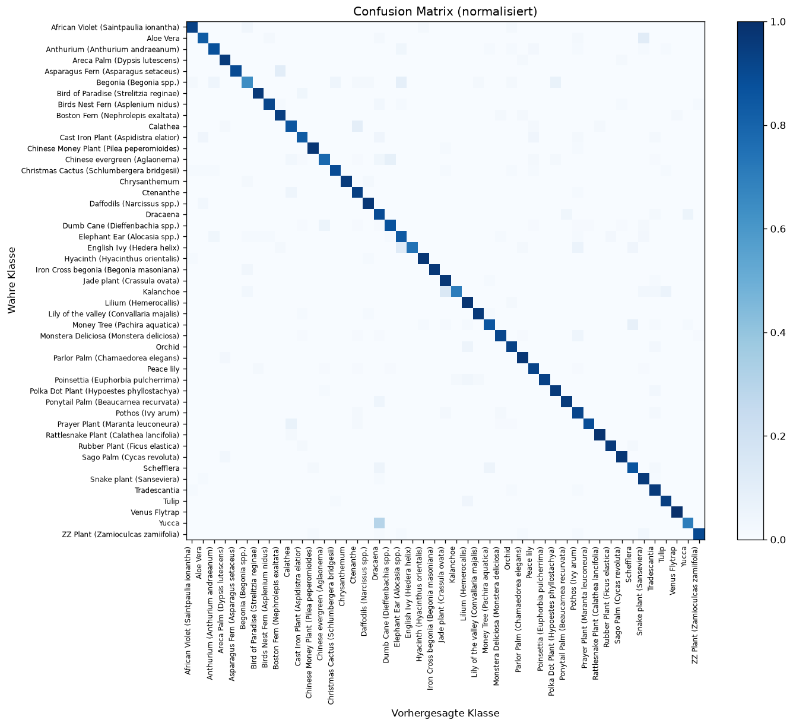

# Benchmark: Modellvergleich

**Tasks:** crop_disease, houseplant_health, houseplant_species

# Task: crop_disease

**Datensatz:** 38 Klassen, 70.295 Train- / 17.572 Val-Bilder.
**Hardware/Device:** privateuseone:0

## Überblick

| Modell | Val-Accuracy | Macro-F1 | Params | Modellgröße | Train-Zeit | Inferenz | Testbilder |
|---|---|---|---|---|---|---|---|
| **efficientnet_b0** | 99.69% | 0.9969 | 4.1M | 23.6 MB | 90m 6s | 2.89 ms/Bild | 32/33 |
| **resnet18** | 99.52% | 0.9951 | 11.2M | 64.7 MB | 24m 31s | 0.54 ms/Bild | 33/33 |

## Konfiguration

- **efficientnet_b0** (efficientnet_b0): 2 Kopf- + 3 Fine-Tuning-Epochen, batch=32, lr_head=0.001, lr_finetune=0.0001
- **resnet18** (resnet18): 2 Kopf- + 3 Fine-Tuning-Epochen, batch=32, lr_head=0.001, lr_finetune=0.0001

## Trainingsverlauf (Val-Accuracy je Epoche)

- **efficientnet_b0**: 93.4% → 94.1% → 99.2% → 99.6% → 99.7%
- **resnet18**: 91.0% → 91.9% → 97.7% → 98.9% → 99.5%

## Schwächste Klassen (niedrigster F1)

- **efficientnet_b0**: Corn_(maize)___Cercospora_leaf_spot Gray_leaf_spot (0.972), Corn_(maize)___Northern_Leaf_Blight (0.975), Tomato___Target_Spot (0.987)
- **resnet18**: Corn_(maize)___Cercospora_leaf_spot Gray_leaf_spot (0.957), Corn_(maize)___Northern_Leaf_Blight (0.962), Tomato___Target_Spot (0.979)

## Testbild-Vorhersagen (unabhängige Fotos)

### efficientnet_b0

| Bild | Wahrheit | Vorhersage | Konfidenz | ✓ |
|---|---|---|---|---|
| AppleCedarRust1.JPG | Apple___Cedar_apple_rust | Apple___Cedar_apple_rust | 100.0% | ✅ |
| AppleCedarRust2.JPG | Apple___Cedar_apple_rust | Apple___Cedar_apple_rust | 100.0% | ✅ |
| AppleCedarRust3.JPG | Apple___Cedar_apple_rust | Apple___Cedar_apple_rust | 99.9% | ✅ |
| AppleCedarRust4.JPG | Apple___Cedar_apple_rust | Apple___Cedar_apple_rust | 100.0% | ✅ |
| AppleScab1.JPG | Apple___Apple_scab | Apple___Apple_scab | 100.0% | ✅ |
| AppleScab2.JPG | Apple___Apple_scab | Apple___Apple_scab | 100.0% | ✅ |
| AppleScab3.JPG | Apple___Apple_scab | Apple___Apple_scab | 99.9% | ✅ |
| CornCommonRust1.JPG | Corn_(maize)___Common_rust_ | Corn_(maize)___Common_rust_ | 100.0% | ✅ |
| CornCommonRust2.JPG | Corn_(maize)___Common_rust_ | Corn_(maize)___Common_rust_ | 100.0% | ✅ |
| CornCommonRust3.JPG | Corn_(maize)___Common_rust_ | Corn_(maize)___Common_rust_ | 100.0% | ✅ |
| PotatoEarlyBlight1.JPG | Potato___Early_blight | Potato___Early_blight | 100.0% | ✅ |
| PotatoEarlyBlight2.JPG | Potato___Early_blight | Potato___Early_blight | 100.0% | ✅ |
| PotatoEarlyBlight3.JPG | Potato___Early_blight | Potato___Early_blight | 100.0% | ✅ |
| PotatoEarlyBlight4.JPG | Potato___Early_blight | Potato___Early_blight | 99.9% | ✅ |
| PotatoEarlyBlight5.JPG | Potato___Early_blight | Potato___Early_blight | 100.0% | ✅ |
| PotatoHealthy1.JPG | Potato___healthy | Potato___healthy | 100.0% | ✅ |
| PotatoHealthy2.JPG | Potato___healthy | Potato___healthy | 100.0% | ✅ |
| TomatoEarlyBlight1.JPG | Tomato___Early_blight | Tomato___Late_blight | 58.2% | ❌ |
| TomatoEarlyBlight2.JPG | Tomato___Early_blight | Tomato___Early_blight | 100.0% | ✅ |
| TomatoEarlyBlight3.JPG | Tomato___Early_blight | Tomato___Early_blight | 90.8% | ✅ |
| TomatoEarlyBlight4.JPG | Tomato___Early_blight | Tomato___Early_blight | 99.9% | ✅ |
| TomatoEarlyBlight5.JPG | Tomato___Early_blight | Tomato___Early_blight | 100.0% | ✅ |
| TomatoEarlyBlight6.JPG | Tomato___Early_blight | Tomato___Early_blight | 99.4% | ✅ |
| TomatoHealthy1.JPG | Tomato___healthy | Tomato___healthy | 100.0% | ✅ |
| TomatoHealthy2.JPG | Tomato___healthy | Tomato___healthy | 99.9% | ✅ |
| TomatoHealthy3.JPG | Tomato___healthy | Tomato___healthy | 100.0% | ✅ |
| TomatoHealthy4.JPG | Tomato___healthy | Tomato___healthy | 100.0% | ✅ |
| TomatoYellowCurlVirus1.JPG | Tomato___Tomato_Yellow_Leaf_Curl_Virus | Tomato___Tomato_Yellow_Leaf_Curl_Virus | 100.0% | ✅ |
| TomatoYellowCurlVirus2.JPG | Tomato___Tomato_Yellow_Leaf_Curl_Virus | Tomato___Tomato_Yellow_Leaf_Curl_Virus | 100.0% | ✅ |
| TomatoYellowCurlVirus3.JPG | Tomato___Tomato_Yellow_Leaf_Curl_Virus | Tomato___Tomato_Yellow_Leaf_Curl_Virus | 100.0% | ✅ |
| TomatoYellowCurlVirus4.JPG | Tomato___Tomato_Yellow_Leaf_Curl_Virus | Tomato___Tomato_Yellow_Leaf_Curl_Virus | 100.0% | ✅ |
| TomatoYellowCurlVirus5.JPG | Tomato___Tomato_Yellow_Leaf_Curl_Virus | Tomato___Tomato_Yellow_Leaf_Curl_Virus | 100.0% | ✅ |
| TomatoYellowCurlVirus6.JPG | Tomato___Tomato_Yellow_Leaf_Curl_Virus | Tomato___Tomato_Yellow_Leaf_Curl_Virus | 100.0% | ✅ |

### resnet18

| Bild | Wahrheit | Vorhersage | Konfidenz | ✓ |
|---|---|---|---|---|
| AppleCedarRust1.JPG | Apple___Cedar_apple_rust | Apple___Cedar_apple_rust | 100.0% | ✅ |
| AppleCedarRust2.JPG | Apple___Cedar_apple_rust | Apple___Cedar_apple_rust | 100.0% | ✅ |
| AppleCedarRust3.JPG | Apple___Cedar_apple_rust | Apple___Cedar_apple_rust | 99.9% | ✅ |
| AppleCedarRust4.JPG | Apple___Cedar_apple_rust | Apple___Cedar_apple_rust | 100.0% | ✅ |
| AppleScab1.JPG | Apple___Apple_scab | Apple___Apple_scab | 100.0% | ✅ |
| AppleScab2.JPG | Apple___Apple_scab | Apple___Apple_scab | 100.0% | ✅ |
| AppleScab3.JPG | Apple___Apple_scab | Apple___Apple_scab | 100.0% | ✅ |
| CornCommonRust1.JPG | Corn_(maize)___Common_rust_ | Corn_(maize)___Common_rust_ | 100.0% | ✅ |
| CornCommonRust2.JPG | Corn_(maize)___Common_rust_ | Corn_(maize)___Common_rust_ | 100.0% | ✅ |
| CornCommonRust3.JPG | Corn_(maize)___Common_rust_ | Corn_(maize)___Common_rust_ | 100.0% | ✅ |
| PotatoEarlyBlight1.JPG | Potato___Early_blight | Potato___Early_blight | 100.0% | ✅ |
| PotatoEarlyBlight2.JPG | Potato___Early_blight | Potato___Early_blight | 100.0% | ✅ |
| PotatoEarlyBlight3.JPG | Potato___Early_blight | Potato___Early_blight | 100.0% | ✅ |
| PotatoEarlyBlight4.JPG | Potato___Early_blight | Potato___Early_blight | 100.0% | ✅ |
| PotatoEarlyBlight5.JPG | Potato___Early_blight | Potato___Early_blight | 100.0% | ✅ |
| PotatoHealthy1.JPG | Potato___healthy | Potato___healthy | 100.0% | ✅ |
| PotatoHealthy2.JPG | Potato___healthy | Potato___healthy | 100.0% | ✅ |
| TomatoEarlyBlight1.JPG | Tomato___Early_blight | Tomato___Early_blight | 80.5% | ✅ |
| TomatoEarlyBlight2.JPG | Tomato___Early_blight | Tomato___Early_blight | 99.2% | ✅ |
| TomatoEarlyBlight3.JPG | Tomato___Early_blight | Tomato___Early_blight | 91.0% | ✅ |
| TomatoEarlyBlight4.JPG | Tomato___Early_blight | Tomato___Early_blight | 100.0% | ✅ |
| TomatoEarlyBlight5.JPG | Tomato___Early_blight | Tomato___Early_blight | 99.6% | ✅ |
| TomatoEarlyBlight6.JPG | Tomato___Early_blight | Tomato___Early_blight | 99.6% | ✅ |
| TomatoHealthy1.JPG | Tomato___healthy | Tomato___healthy | 100.0% | ✅ |
| TomatoHealthy2.JPG | Tomato___healthy | Tomato___healthy | 100.0% | ✅ |
| TomatoHealthy3.JPG | Tomato___healthy | Tomato___healthy | 99.3% | ✅ |
| TomatoHealthy4.JPG | Tomato___healthy | Tomato___healthy | 99.8% | ✅ |
| TomatoYellowCurlVirus1.JPG | Tomato___Tomato_Yellow_Leaf_Curl_Virus | Tomato___Tomato_Yellow_Leaf_Curl_Virus | 100.0% | ✅ |
| TomatoYellowCurlVirus2.JPG | Tomato___Tomato_Yellow_Leaf_Curl_Virus | Tomato___Tomato_Yellow_Leaf_Curl_Virus | 100.0% | ✅ |
| TomatoYellowCurlVirus3.JPG | Tomato___Tomato_Yellow_Leaf_Curl_Virus | Tomato___Tomato_Yellow_Leaf_Curl_Virus | 100.0% | ✅ |
| TomatoYellowCurlVirus4.JPG | Tomato___Tomato_Yellow_Leaf_Curl_Virus | Tomato___Tomato_Yellow_Leaf_Curl_Virus | 100.0% | ✅ |
| TomatoYellowCurlVirus5.JPG | Tomato___Tomato_Yellow_Leaf_Curl_Virus | Tomato___Tomato_Yellow_Leaf_Curl_Virus | 100.0% | ✅ |
| TomatoYellowCurlVirus6.JPG | Tomato___Tomato_Yellow_Leaf_Curl_Virus | Tomato___Tomato_Yellow_Leaf_Curl_Virus | 100.0% | ✅ |

## Diagramme

**Accuracy vs. Trainingszeit**

**Val-Accuracy je Epoche**

## Confusion-Matrizen

- **efficientnet_b0**: 
- **resnet18**: 

---

# Task: houseplant_health

**Datensatz:** Healthy vs. Wilted Houseplants — 2 Klassen, 724 Train- / 180 Val-Bilder.
**Hardware/Device:** privateuseone:0

## Überblick

| Modell | Val-Accuracy | Macro-F1 | Params | Modellgröße | Train-Zeit | Inferenz | Testbilder |
|---|---|---|---|---|---|---|---|
| **houseplant_health** | 88.33% | 0.8833 | 11.2M | 64.6 MB | 2m 30s | 0.54 ms/Bild | — |

## Konfiguration

- **houseplant_health** (resnet18): 2 Kopf- + 3 Fine-Tuning-Epochen, batch=32, lr_head=0.001, lr_finetune=0.0001

## Trainingsverlauf (Val-Accuracy je Epoche)

- **houseplant_health**: 73.9% → 80.6% → 82.8% → 88.3% → 85.6%

## Schwächste Klassen (niedrigster F1)

- **houseplant_health**: wilted (0.883), healthy (0.884)

## Testbild-Vorhersagen (unabhängige Fotos)

## Diagramme

**Accuracy vs. Trainingszeit**

**Val-Accuracy je Epoche**

## Confusion-Matrizen

- **houseplant_health**: 

---

# Task: houseplant_species

**Datensatz:** House Plant Species (47 Arten) — 47 Klassen, 11.820 Train- / 2.954 Val-Bilder.
**Hardware/Device:** privateuseone:0

## Überblick

| Modell | Val-Accuracy | Macro-F1 | Params | Modellgröße | Train-Zeit | Inferenz | Testbilder |
|---|---|---|---|---|---|---|---|
| **houseplant_species** | 91.33% | 0.9038 | 11.2M | 64.7 MB | 12m 39s | 0.54 ms/Bild | 2 (ohne GT) |
| **houseplant_species_weighted** | 90.93% | 0.9038 | 11.2M | 64.7 MB | 12m 10s | 0.54 ms/Bild | 2 (ohne GT) |

## Konfiguration

- **houseplant_species** (resnet18): 2 Kopf- + 3 Fine-Tuning-Epochen, batch=32, lr_head=0.001, lr_finetune=0.0001
- **houseplant_species_weighted** (resnet18): 2 Kopf- + 3 Fine-Tuning-Epochen, batch=32, lr_head=0.001, lr_finetune=0.0001

## Trainingsverlauf (Val-Accuracy je Epoche)

- **houseplant_species**: 65.0% → 71.5% → 86.6% → 88.5% → 91.3%
- **houseplant_species_weighted**: 65.8% → 69.5% → 85.6% → 89.1% → 90.9%

## Schwächste Klassen (niedrigster F1)

- **houseplant_species**: Yucca (0.533), Begonia (Begonia spp.) (0.700), Kalanchoe (0.737)
- **houseplant_species_weighted**: Yucca (0.667), Begonia (Begonia spp.) (0.716), Dracaena (0.784)

## Testbild-Vorhersagen (unabhängige Fotos)

### houseplant_species

| Bild | Wahrheit | Vorhersage | Konfidenz | ✓ |
|---|---|---|---|---|
| zimerpflanze_kevin.jpeg | — | Snake plant (Sanseviera) | 99.1% | — |
| zimmerpflanze_kevin_1.jpeg | — | Dracaena | 76.5% | — |

### houseplant_species_weighted

| Bild | Wahrheit | Vorhersage | Konfidenz | ✓ |
|---|---|---|---|---|
| zimerpflanze_kevin.jpeg | — | Snake plant (Sanseviera) | 97.9% | — |
| zimmerpflanze_kevin_1.jpeg | — | Dracaena | 81.0% | — |

## Diagramme

**Accuracy vs. Trainingszeit**

**Val-Accuracy je Epoche**

## Confusion-Matrizen

- **houseplant_species**: 
- **houseplant_species_weighted**: 

---

# Historie (alle Läufe, chronologisch)

_Aus `results/history.jsonl` — zeigt den Effekt von Modell- und Hyperparameter-Änderungen über die Zeit._

## crop_disease

| Zeitpunkt | Run | Backbone | Epochen (K+F) | Batch | lr_head | lr_ft | Sampler | Val-Acc | Macro-F1 | Train-Zeit | Testbilder |
|---|---|---|---|---|---|---|---|---|---|---|---|
| 2026-06-23 23:49:27 | resnet18 | resnet18 | 2+3 | 32 | 0.001 | 0.0001 | — | 99.52% | 0.9951 | 24m 31s | 33/33 |
| 2026-06-24 01:20:54 | efficientnet_b0 | efficientnet_b0 | 2+3 | 32 | 0.001 | 0.0001 | — | 99.69% | 0.9969 | 90m 6s | 32/33 |

## houseplant_species

| Zeitpunkt | Run | Backbone | Epochen (K+F) | Batch | lr_head | lr_ft | Sampler | Val-Acc | Macro-F1 | Train-Zeit | Testbilder |
|---|---|---|---|---|---|---|---|---|---|---|---|
| 2026-06-24 02:16:42 | houseplant_species | resnet18 | 2+3 | 32 | 0.001 | 0.0001 | — | 91.33% | 0.9038 | 12m 39s | — |
| 2026-06-24 02:33:11 | houseplant_species_weighted | resnet18 | 2+3 | 32 | 0.001 | 0.0001 | weighted | 90.93% | 0.9038 | 12m 10s | — |

## houseplant_health

| Zeitpunkt | Run | Backbone | Epochen (K+F) | Batch | lr_head | lr_ft | Sampler | Val-Acc | Macro-F1 | Train-Zeit | Testbilder |
|---|---|---|---|---|---|---|---|---|---|---|---|
| 2026-06-24 02:19:33 | houseplant_health | resnet18 | 2+3 | 32 | 0.001 | 0.0001 | — | 88.33% | 0.8833 | 2m 30s | — |

---
